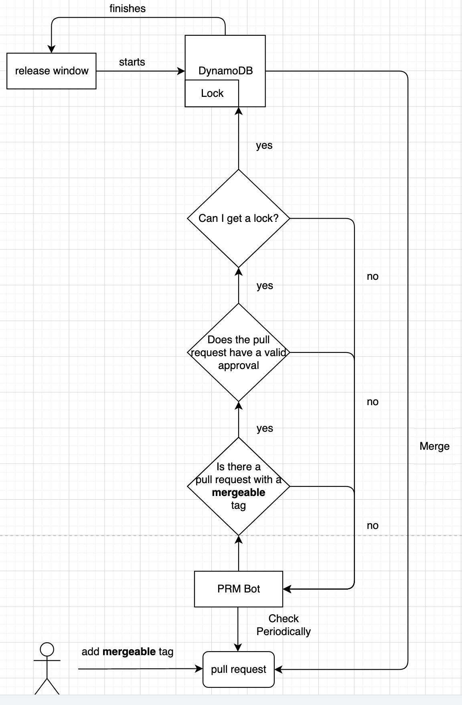

Introduction
============
This page is here to answer your questions about why Sling exists and its goals.

How It Works
------------
While Sling definitely has the potential to be used in our situations,
its original concept was to work with  and as such we will explain 
how it works. The idea is that some user adds a "mergeable" tag to a certain 
GitHub repo's pull requests. The "mergeable" pull requests must then be 
have a review approving merge from a valid entity such as the repo's owner (
can be customized for other user groups). After this process is complete, 
Sling will attempt to merge that specific pull request.

Sling detects this pull request via an AWS lambda which has been
named PRMBot. PRMBot is a simple program that just periodically spins up to 
check if a valid pull request exists on a GitHub repo. If it detects such a 
pull requests, it will then attempt to grab a lock via its own lock API.
If said lock is available, Sling will promptly merge the pull request and 
then release the lock. If said lock is not available, the bot simply goes to 
sleep and wait until the next wakeup to try again. The key to how Sling 
functions is its locking system and through it, we are able to restrict when pull
requests should not be merged. 

A flow chart demonstrating a high-leveled view of this process is shown below.

PRMBot
------
Conceptually, the PRMBot is just a simple bot that takes in some user-set 
values in a config file to periodically access a specific GitHub repository.
Below is an example config file setup.

.. code-block:: json

    {
    "secret_name": "test/github_username",
    "region_name": "us-west-2",
    "repo_owner": "jadeknightjr",
    "repo_name": "dumpy",
    "merge_label": "mergeable",
    "merge_type": "merge",
    "commit_title": "commit message",
    "commit_msg": "Default Commit Message",
    "service_name": "PRMBot",
    "lock_name": "MyLock",
    "api_route": "https://rest-api-id.execute-api.region-name.amazonaws.com/api/"
    }

This is what each parameter represents. 

.. code-block:: python

    #secret_name: Name of the Secrets Manager. Your Secrets Manager must contain the key-value pairs of “github_username” and “github_password”
    #region_name: Region of the Secrets Manager.
    #repo_owner: Owner of the GitHub Repository you care about.
    #repo_name: Name of the GitHub Repository you care about.
    #merge_label: What label you care about for your pull requests.
    #merge_type: What type of GitHub merge you want. Currently. we only support “merge.”
    #commit_title: Specific GitHub commit title you would like when merging the pull request.
    #commit_msg: Specific GitHub commit message you would like when merging the pull request.
    #service_name: What service you want the repository to be named under.
    #lock_name: What lock you want this repository to try to obtain.
    #api_route: What is the url for your API that is formed when running *chalice deploy.*

In essence, the bot will first read in the config file, and grab the GitHub 
login credentials from an AWS Secrets Manager that the user will have to set up.
As mentioned in the how it works section, the bot will pull in all pull
requests of the repo with the "mergeable" tag. It will then filter those down to 
only those who have a valid review, meaning an approve review from a 
configurable selected source. It will then request a lock via our lock api. It 
will merge the pull requests only if a lock is granted as it will otherwise do 
nothing. After merging the valid pull requests, the PRMBot will release the 
locks and shut down.

To control how often a PRMBot runs, make sure you set up an environmental 
varaible called **PRM_BOT_RUNTME**. By default this values is set to 5 hours.

Note that if something fails - such as a lock couldn't be
released - our PRMBot will log a critical error, causing Sling to
trigger a Cloudwatch alarm it has set up. The user will then be able to go
to the logs and act accordingly based on the error message.

Locking System
--------------
The bread and butter of this application is the locking system. 

.. code-block:: python

    #        Lock Table
    # LockId | LockName    | HeldBy | Start_DateTime
    # ------------------------------------------------------
    # 0001   | My_Lock |  AE0   | 2020-06-03T10:07:18Z
    
    # LockID (Primary Key): UUID of the lock generated.
    # LockName: Name of the lock
    # HeldBy: UUID of the service which currently holds a lock. Is an empty string
    # if no service currently acquires it
    # Start_DateTime: The DateTime of when the lock was last held
    
    
    #    Registered Services Table
    # Service_Id  | Service       
    # ----------------------------
    # AE12        | Service1
    # Ae13        | Service2

    # Id (Primary Key): UUID of a "whitelisted" service
    # Service: Name of the service

    
    #    Log Table
    # LockName    | LockId |  Service   | JobId | Start_DateTime       | End_DateTime
    # ---------------------------------------------------------------------------------------
    # Merge Lock  | 0001   | Service1   | 1021  | 2020-06-03T10:07:18Z | 2020-06-03T10:07:20Z
    
    # LockName: Name of the lock
    # Lock Id: UUID of the lock
    # Service: Name of the service who acquired lock
    # Start_DateTime: DateTime of when the lock was acquired
    # End_DateTime: DateTime of when the lock was released

Sling's locking system revolves around 2 main DynamoDB Tables and a
third DynamoDB table for logging purposes. Locks represent a resource that 
services are trying to work with. Only services in the Registered Services
Table may attempt to obtain a lock in the Lock Table. 

As can be seen from the diagram, Sling is built with 
scalability in mind. As such, users can potentially build a system with many 
locks and services and our API can scale to the number of services and locks.
Keep in mind that users will have to develop their 
own permissions system, as the current rendition of Sling allows any
registered service to attempt to take any lock from the Lock Table.

Future
------
Even though Sling is at the stage of a minimal viable product,
there is so much more that can be built upon this. In the future, I'd like this
product to be lauched via a single AWS CDK setup. Furthermore, there is the
avenue of allowing Sling to handle more robust Git operations such
as preview merging or rebasing.
