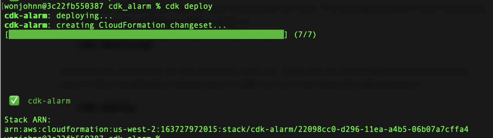
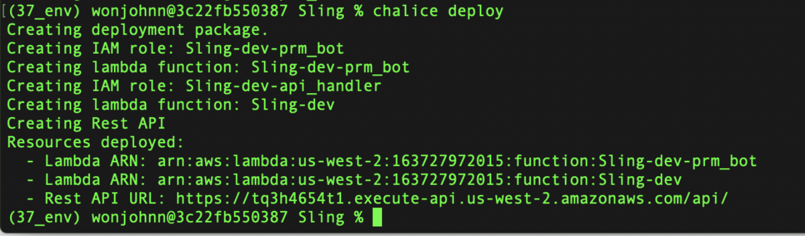

Setup
=====
In the current rendition of Sling, please launch the AWS CDK portion
first. Currently, AWS Chalice does not support launching DynamoDB tables. This  
results in a more convoluted deployement process than I'd like, but will be 
something that I will be looking into in a future version.

In order to set up Sling, there are a few things you must do first. Make sure 
that you have Python3 on your machine, ideally Python 3.6 or Python 3.7. If
you are on AWS EC2, there are instruction to do so on this stackoverflow_,but
make sure you use an updated python version. 

Then make sure you have Node. If you are on a local Windows or Mac, you can use
the installer on Node’s website. If you are trying to do this through a EC2 
instance, follw the guide on AWS docs_. Make sure you have ran aws configure. 
If not, follow this tutorial here_ to set up your AWS configuration setting.

.. _stackoverflow: https://stackoverflow.com/questions/27669927/how-do-i-install-python-3-on-an-aws-ec2-instance
.. _docs: https://docs.aws.amazon.com/sdk-for-javascript/v2/developer-guide/setting-up-node-on-ec2-instance.html
.. _here: https://docs.aws.amazon.com/cli/latest/userguide/cli-configure-files.html

Quick Deploy
------------
To quickly deploy the aplication, make sure you are inside Sling and run the following command

.. code-block:: bash

    deploy.sh

This simply deploys Sling, however it will not update your config file
with the newly created rest API url. To do that, you can run the command with a 
**-c** flag. If you'd like to destroy your previous deployment and redeploy
Sling rather than update the existing Sling, use the **-d**
flag.

.. code-block:: bash

    deploy.sh -c -d

Manual DeployMent Part1 : AWS CDK Component
-----------------------------------------------
We should first deploy the APIGateway and PRMBot of Sling via AWS
Chalice. However, we should do all of this in a separate enviornment to 
remain organized. Assuming you have Python 3.7 on your system, run the 
following command to create a virtual enviornment:

.. code-block:: bash

    python3.7 -m venv 37_env
    source 37_env/bin/activate

This creates a virtual environment called 37_env and starts it. You should 
now install all the necesary modules now.

.. code-block:: bash

    pip install -r requirements.txt

At this point, you should fill in your config file. What to put in each value
of the config is viewable in the :ref:`PRMBot` section.

Now we are ready to chalice deploy. One very useful feature with AWS Chalice is 
that so long as your third party packaging is written in the correct format in 
**Sling/requirements.txt**, chalice will automatically install any 
packages it finds or can build compatible wheels for them. All we need to do is
to go into the project directory and simply deploy.

First cd out of cdk_environment_setup.

.. code-block:: bash

    cd ..
    chalice deploy

This will take a few minutes to finish. You should get something like the 
following below. You are halfway there! If not, check that you deployed using 
Python 3.7.

**Note:** If you used sudo when installing your python versions, it puts that 
python version in your root which may cause issues. Reinstall your Python 
versions without using sudo. You should get something similar below.

Notice that we are provided a REST API URL. This is the url you should put in 
your **Sling/chalicelib/settings/config.json.** In fact, you should
now input pertinent information in your **config.json** file if you haven’t
done so yet.

Manual Deployment Part 2: AWS Chalice Component
-----------------------------------------------

We should now deploy the DynamoDB tables and Cloudwatch alarms with custom
metrics first.  Now we candeploy our tables and alarms. Run the following 
commands:

.. code-block:: bash

    cd Sling/cdk_environment_setup
    pip install -r requirements.txt

This will install all third party modules written in our cdk_environment_setup's 
requirements.txt file. If you are running into any errors, make sure you are 
still in the 37_env environment we set up earlier. Since it is our first time 
deploying our app, we need to bootstrap our stack. This basically allocates a
stack containing AWS resources we need for our CDK operations.

.. code-block:: bash

    cdk bootstrap

Now we can deploy the cdk application.

.. code-block:: bash

    cdk deploy

If you get something like below, everything is deployed properly.

When you are done, you can exit your virtual enviornemnt with the **deactivate**
command.

Additional Notes
----------------
When you are testing your PRMBot lambdas, your tests will need to be in a
specific format. The values in the json doesn't matter and isn't actually
needed when the program actually runs periodically via environemental
variable **PRM_BOT_RUNTIM**. An example format is shown below

.. code-block:: javascript

    {
        "version": "0",
        "id": "6a7e8feb-b491-4cf7-a9f1-bf3703467718",
        "detail-type": "EC2 Instance State-change Notification",
        "source": "aws.ec2",
        "account": "111122223333",
        "time": "2017-12-22T18:43:48Z",
        "region": "us-west-1",
        "resources": [
            "arn:aws:ec2:us-west-1:123456789012:instance/ i-1234567890abcdef0"
        ],
        "detail": {
            "instance-id": " i-1234567890abcdef0",
            "state": "terminated"
        }
    }

This isn't necesary when it's actually running though.

Takedown
--------

To take down AWS CDK, make sure you are in the **Sling/cdk_environment_setup** 
directory. Run the command **cdk destroy** to take down everything deployed by AWS CDK.

To take down AWS Chalice, make sure you are in the top level of the 
**Sling** application. Run the command **cdk delete** to take down 
everything deployed via cdk AWS Chalice.

**Note:** The Rest API url changes everytime you redeploy chalice 
after a **cdk delete** but not from using **cdk deploy**.

